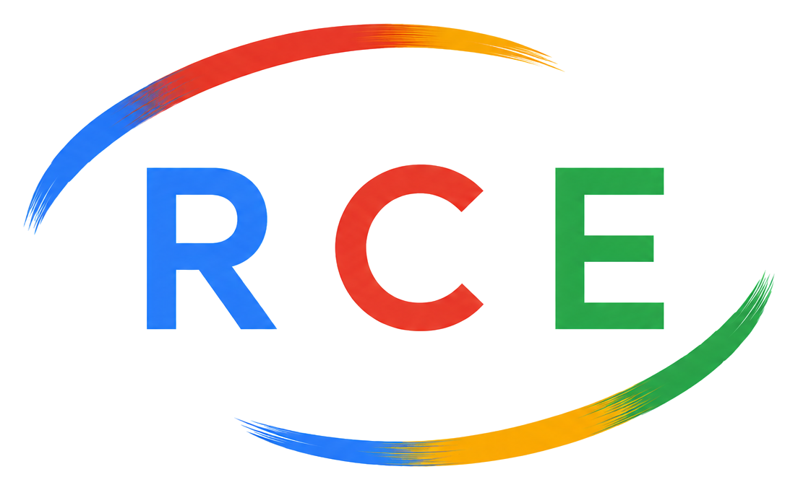
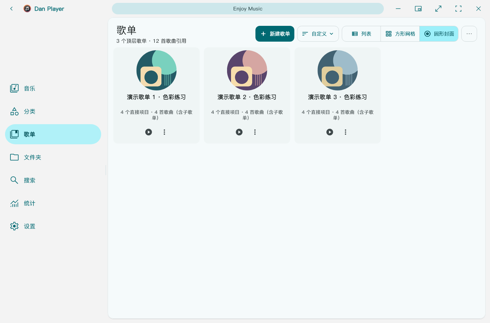
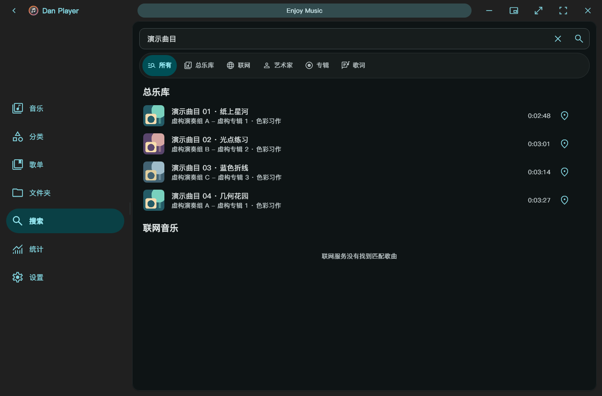

<div align="center">

<p>
  <picture>
    <source media="(prefers-color-scheme: dark)" srcset="assets/images/RCE_logo_white.png">
    <source media="(prefers-color-scheme: light)" srcset="assets/images/RCE_logo_transparent.png">
    
  </picture>
</p>

<h1>Dan Player</h1>

<p><strong>나만의 로컬 음악 컬렉션을 위한 플레이어.</strong></p>

<p>라이브러리 정리, 가사 표시, 데스크톱 사용 경험을 갖춘 Windows x64 음악 플레이어입니다.<br>
로컬 재생을 중심으로 온라인 음악과 사용자 지정 소스도 지원합니다.</p>

<p align="center">
  <a href="https://github.com/DanRuguo/dan_player/releases/latest"></a>
  <a href="https://github.com/DanRuguo/dan_player/releases"></a>
  <a href="https://github.com/DanRuguo/dan_player/releases"></a>
  <a href="LICENSE"></a>
</p>

<p align="center">
  <a href="#download"></a>
  <a href="#development"></a>
  <a href="#development"></a>
  <a href="https://www.un4seen.com/bass.html"></a>
</p>

<p>
  <a href="https://github.com/DanRuguo/dan_player/releases/latest"><strong>안정 버전 다운로드</strong></a> ·
  <a href="https://github.com/DanRuguo/dan_player/releases/tag/v26.0.5-snapshot.3">미리 보기 버전 체험</a> ·
  <a href="https://github.com/DanRuguo/dan_player/releases">변경 내용</a> ·
  <a href="https://github.com/DanRuguo/dan_player/issues/new/choose">문제 보고</a>
</p>

<p>
  <a href="README.md">简体中文</a> ·
  <a href="README.en.md">English</a> ·
  <a href="README.ja.md">日本語</a> ·
  <strong>한국어</strong>
</p>

</div>

<p align="center">
  <picture>
    <source media="(prefers-color-scheme: dark)" srcset="docs/images/library-dark-wide.png">
    <source media="(prefers-color-scheme: light)" srcset="docs/images/library-light-wide.png">
    
  </picture>
</p>

<p align="center">
  <a href="#download">다운로드</a> ·
  <a href="#features">주요 기능</a> ·
  <a href="#screenshots">화면 미리 보기</a> ·
  <a href="#quick-start">시작하기</a> ·
  <a href="#development">개발 및 빌드</a>
</p>

<a id="download"></a>

## 다운로드 및 설치

| 버전 | 용도 | 다운로드 |
| --- | --- | --- |
| **26.0.4 · 안정 버전** | 일상적인 음악 감상에 사용할 정식 릴리스 | [설치 프로그램, 포터블 ZIP 및 체크섬](https://github.com/DanRuguo/dan_player/releases/tag/v26.0.4) |
| **26.0.5-snapshot.3 · 미리 보기 버전** | 다음 안정 버전에 앞서 개인 라이브러리, 전체 북마크 관리 등의 새 기능 체험 | [설치 프로그램, 포터블 ZIP 및 체크섬](https://github.com/DanRuguo/dan_player/releases/tag/v26.0.5-snapshot.3) |

**설치 버전**은 설치 프로그램을 실행하면 되며, 기존 설치를 업데이트할 수 있습니다. **포터블 버전**은 ZIP 전체를 압축 해제한 뒤 `Dan Player.exe`를 실행하세요. EXE 파일만 따로 복사하지 마세요. 26.0.5 미리 보기 버전의 바탕 화면 가사는 동일한 실행 파일에서 별도 프로세스로 실행됩니다.

> **다운로드 및 서명 안내:** 프로젝트에서 빌드한 실행 파일은 RCEIT.Inc 자체 서명 인증서를 사용하므로 Windows에 신뢰 관련 경고가 나타날 수 있습니다. 설치 프로그램은 신뢰할 수 있는 인증서를 자동으로 설치하지 않습니다. 이전 서명을 사용하는 버전에서 업데이트할 때는 새 설치 프로그램을 직접 다운로드하세요. 미리 보기 버전은 Latest로 표시된 안정 버전을 대체하지 않습니다. 업데이트 전에 앱의 백업 및 복원 설정에서 개인 데이터를 백업하는 것이 좋습니다.

<a id="download-verification"></a>

<details>
<summary><strong>SHA-256으로 다운로드 파일 확인</strong></summary>

동일한 Release 페이지에서 프로그램과 `SHA256SUMS`를 다운로드하세요. 설치 프로그램이나 ZIP의 SHA-256을 계산한 뒤 체크섬 파일 및 GitHub 에셋 다이제스트와 비교하세요. 아래 예시의 파일명은 실제 다운로드한 파일명으로 바꾸세요.

```powershell
Get-FileHash -LiteralPath '.\DanPlayer-VERSION-Setup-x64.exe' -Algorithm SHA256
```

해시가 일치하면 공개된 배포 파일과 내용이 같다는 뜻이며, Windows가 서명 인증서를 신뢰한다는 뜻은 아닙니다. 다운로드 출처를 확인하고, 출처가 불분명한 파일을 실행하기 위해 시스템 보안 기능을 끄지 마세요.

</details>

<a id="features"></a>

## 주요 기능

곡 하나를 찾을 때도, 전체 컬렉션을 정리할 때도 같은 음악 라이브러리를 중심으로 작업할 수 있습니다.

| 영역 | 주요 기능 |
| --- | --- |
| **라이브러리 및 검색** | 아티스트, 앨범, 형식, 폴더별 탐색. 곡 검색, 메타데이터 일괄 편집 및 라이브러리 상태 확인. |
| **재생목록 및 대기열** | 계층형 재생목록, 드래그 순서 변경, 스마트 조건, M3U8 가져오기와 내보내기. 대기열 저장, 작업 실행 취소 및 재생목록 복원. |
| **가사** | 가사 검색, 편집, 수정본 관리, 잠금, 타이밍 보정. 전체 텍스트 검색, 바탕 화면 가사 및 미니 플레이어 표시. |
| **재생 및 위치 이동** | CUE 트랙 재생, 이퀄라이저, 음량 평준화, 곡별 이어 듣기, A–B 구간 반복. 재생 위치나 구간을 저장하고 모든 북마크에서 통합 관리. |
| **개인 음악 데이터** | 개인 평점과 태그, 필터링. 음악을 듣는 시간대, 곡 순위, 라이브러리 구성 및 파일 용량 확인. |
| **Windows 사용 경험** | 앨범 아트 기반 색상, 밝은 테마와 어두운 테마, 4개 언어 인터페이스. 단축키, 미니 창, 작업 표시줄 미리 보기 및 재생 진단. |

현재 저장소의 기능을 기준으로 한 설명이며, 일부 기능은 26.0.5 미리 보기 버전에서 제공됩니다. 실제 배포 파일에 포함된 기능은 해당 [Release 변경 내용](https://github.com/DanRuguo/dan_player/releases)을 확인하세요.

온라인 음악과 사용자 지정 소스는 로컬 음악 감상을 보완합니다. 사용자 지정 서비스는 명시적으로 선언한 기능에 따라 검색이나 가사 등을 제공합니다. 연결 방법은 [사용자 지정 음악 소스 API](docs/custom-music-source-api.md)를 참고하세요.

<a id="screenshots"></a>

## 화면 미리 보기

### 나만의 방식으로 컬렉션 정리

| 재생목록 및 컬렉션 | 외관 및 설정 |
| --- | --- |
| <picture><source media="(prefers-color-scheme: dark)" srcset="docs/images/playlists-dark-wide.png"></picture> | <picture><source media="(prefers-color-scheme: dark)" srcset="docs/images/settings-dark-wide.png"></picture> |

### 듣고 싶은 곡을 찾고 가사에 집중

| 곡 검색 | 미니 플레이어 및 가사 |
| --- | --- |
|  |  |

### 청취 기록으로 라이브러리 다시 발견하기


<sub>이미지는 저장소의 기존 리소스를 재사용합니다. 실제 Flutter 위젯을 가상 곡과 격리된 데이터로 렌더링한 것으로, 실시간 오디오나 Windows 네이티브 효과의 검증 결과가 아닙니다. 이미지는 중국어 인터페이스를 사용하지만 앱은 영어, 일본어, 한국어도 지원합니다. 밝은 테마와 어두운 테마, 여러 창 너비, 추가 기능은 <a href="docs/images/README.md">화면 갤러리</a>에서 확인할 수 있습니다.</sub>

<a id="quick-start"></a>

## 시작하기

**음악 추가.** 음악 파일이나 폴더를 가져온 뒤 곡, 분류, 재생목록 화면에서 탐색하세요. 계층형 재생목록과 드래그 순서 변경으로 컬렉션을 정리할 수 있습니다.

**개인 평점과 태그 관리.** 26.0.5 미리 보기 버전에서는 분류 화면의 **개인 라이브러리 → 곡**에서 평점이나 개인 태그를 지정한 곡을 확인하고 날짜, 평점, 태그로 필터링할 수 있습니다. 개인 평점과 태그는 플레이어 데이터에 저장되며 **음악 파일에는 기록되지 않습니다**. 반면 메타데이터 편집과 태그 일괄 편집은 파일의 메타데이터를 변경하므로 저장 전에 변경 내용을 확인하세요.

**좋아하는 순간 저장.** 현재 재생 화면의 더 보기 메뉴에서 재생 북마크 창을 열어 현재 위치나 A–B 구간을 저장하세요. 저장한 항목은 분류 화면의 **개인 라이브러리 → 모든 북마크**에서 찾을 수 있습니다. 이 목록의 재생 버튼은 저장된 시작 위치부터 재생합니다. A–B 반복 구간을 복원하려면 해당 곡의 재생 북마크 창에서 그 구간을 선택하세요.

**데이터 백업.** 설정의 백업 및 복원 기능으로 플레이어 데이터를 저장하세요. 프로그램 업데이트와 개인 데이터 백업은 서로 다른 작업입니다. 설치 폴더의 프로그램 파일은 라이브러리, 재생목록, 설정의 백업을 대신하지 않습니다.

<details>
<summary><strong>자주 사용하는 단축키</strong></summary>

| 키 | 동작 |
| --- | --- |
| `Space` | 재생 / 일시 정지 |
| `Ctrl + Left` / `Ctrl + Right` | 이전 곡 / 다음 곡 |
| `Left` / `Right` | 5초 뒤로 / 앞으로 이동 |
| `Ctrl + M` | 미니 플레이어 전환 |
| `F11` | 전체 화면 전환 |
| `F1` | 단축키 보기 |

</details>

<a id="documentation"></a>

## 문서 및 피드백

[화면 갤러리](docs/images/README.md) · [사용자 지정 음악 소스 API](docs/custom-music-source-api.md) · [go-music-api 설정 예시](docs/examples/go-music-api-jamendo.json) · [전체 릴리스](https://github.com/DanRuguo/dan_player/releases)

연결된 갤러리와 API 문서는 현재 중국어로 제공됩니다. 설정 예시의 서비스 주소는 직접 배포한 서비스 주소로 바꾸세요. 문제를 보고하기 전에 [기존 Issues](https://github.com/DanRuguo/dan_player/issues)를 확인한 뒤 [신고 양식](https://github.com/DanRuguo/dan_player/issues/new/choose)을 사용하세요. 플레이어 버전, 재현 단계, 필요한 경우 인터페이스 언어와 창 크기 또는 디스플레이 배율을 알려 주세요. 재생 문제에는 개인정보를 제거한 진단 자료를 첨부할 수 있습니다. 개인 음악 파일, 인증 정보, 개인 폴더의 전체 경로는 공개하지 마세요.

<a id="development"></a>

## 개발 및 빌드

**Flutter, Rust, BASS**를 사용합니다. 개발에는 Flutter, Rust, Visual Studio의 C++를 사용한 데스크톱 개발 워크로드가 필요합니다. Dart 버전 제약은 [pubspec.yaml](pubspec.yaml), 결정된 의존성 버전은 [pubspec.lock](pubspec.lock)과 [rust/Cargo.lock](rust/Cargo.lock)을 확인하세요. Windows 지속적 통합 워크플로는 [Windows CI](.github/workflows/windows_ci.yml)에 정의되어 있습니다.

<details>
<summary><strong>소스 구조, 디버깅 및 필요한 범위의 검사</strong></summary>

| 디렉터리 | 용도 |
| --- | --- |
| `lib/` | 인터페이스, 라이브러리 및 재생 서비스 |
| `rust/`, `rust_builder/` | 태그 처리 및 Flutter/Rust 연결 |
| `windows/`, `installer/` | Windows 통합 및 설치 프로그램 |
| `third_party/` | 포함된 구성 요소 및 라이선스 정보 |
| `test/`, `test_driver/` | 자동화 테스트 |
| `scripts/` | 빌드, 검증 및 릴리스 스크립트 |
| `docs/` | API 문서, 설정 예시 및 인터페이스 이미지 |

저장소 루트에서 실행하세요. 디버깅이 평소 사용하는 라이브러리와 설정에 영향을 주지 않도록 별도 데이터 디렉터리를 사용합니다.

```powershell
$env:DAN_PLAYER_DATA_DIR = [IO.Path]::GetFullPath((Join-Path (Get-Location).Path '../tool/qa-data/readme-debug'))
flutter pub get
flutter run -d windows
```

실행 전에 BASS 런타임을 준비하세요. 관련 스크립트는 `scripts/prepare_bass_runtime.ps1`과 `scripts/prepare_bass_fx_runtime.ps1`입니다. 컴퓨터별 SDK, 런타임 캐시, 서명 설정 경로는 소스 저장소 밖의 로컬 `DEVELOPMENT.md`에만 기록합니다.

검사 단계를 간소화하고 관련 변경 사항을 모듈별로 묶어서 검증하세요. 기능을 하나 추가할 때마다 전체 회귀 테스트, 빌드, 서명을 반복하지 마세요. 예를 들어 통계와 상세 화면 레이아웃 변경은 다음과 같이 확인할 수 있습니다.

```powershell
flutter test test/statistics_visualization_test.dart test/detail_diagnostics_layout_test.dart --no-pub
```

통합 단계에서는 `scripts/verify_interaction_regressions.ps1`을 사용합니다. UI 변경 사항은 실제 Flutter 위젯을 렌더링하여 확인해야 합니다. 공개 이미지는 `scripts/render_public_ui.ps1`과 격리된 가상 데이터로 생성하며, 언어, 창 너비, 글자 배율을 확인합니다. 위젯 렌더링은 실제 오디오 장치 및 Windows 데스크톱 통합 검증을 대신하지 않습니다.

</details>

<details>
<summary><strong>Windows 빌드 및 배포</strong></summary>

기존 배포 스크립트는 소스를 `dan_player/`에, 같은 상위 폴더의 `tool/`에 도구 체인과 캐시를, `dist/`에 결과물을 두는 작업 공간 구조를 전제로 합니다. `build_windows_release.ps1`은 의존성과 배포 조건을 확인하고 Windows 앱을 빌드한 뒤 글꼴과 런타임을 검증합니다.

```powershell
# 위 작업 공간 구조에서 서명 인증서가 없는 경우, 소스 저장소에서 실행:
.\scripts\build_windows_release.ps1 -SkipSigning
```

`-SkipPackaging`은 포터블 패키지 조립을 건너뛰고, `-NoRestore`는 이미 복원된 의존성을 재사용합니다. 서명된 릴리스에는 별도의 인증서 설정이 필요합니다. 설치 프로그램은 `scripts/build_windows_installer.ps1`로 빌드하고, 포터블 패키지와 설치 프로그램은 각각 `verify_local_release.ps1`, `verify_windows_installer.ps1`로 검증합니다.

같은 코드 상태에서는 유효한 검사 결과와 빌드 결과물을 재사용하고, 실패 시 필요한 단계만 다시 실행하세요. 서명 후 소스 커밋, 테스트 검증 기록, 결과물 SHA-256 및 서명을 확인한 뒤 필요한 GitHub 배포 절차만 수행합니다. 미리 보기 버전은 prerelease로 유지하고 안정 버전의 Latest를 대체하지 않습니다. 절차를 줄이기 위해 필수 검증을 생략하지 마세요.

</details>

장기적으로 필요한 문서만 유지합니다. 로컬 개발 메모, 과거 QA 결과, 임시 로그, 도구 캐시, 개인 데이터, 서명 개인 키는 소스 저장소에 포함하지 않습니다. 공개 인터페이스 이미지는 `docs/images/`에 모으고, 이미지가 바뀌면 참조도 함께 업데이트합니다.

<a id="license"></a>

## 라이선스 및 감사의 말

이 프로젝트는 [LICENSE](LICENSE)에 따라 배포됩니다. 타사 구성 요소에는 각자의 라이선스 조건이 적용되며, BASS 사용과 배포는 공식 라이선스를 따라야 합니다.

Dan Player는 [Ferry-200/coriander_player](https://github.com/Ferry-200/coriander_player)를 기반으로 개발되었습니다. 플레이어 기반, 라이브러리 구조, 가사 기능을 제공한 원작자에게 감사드립니다. 또한 [desktop_lyric](https://github.com/Ferry-200/desktop_lyric), [music_api_dart](https://github.com/Ferry-200/music_api_dart), [BASS](https://www.un4seen.com/bass.html), [Lofty](https://crates.io/crates/lofty), [flutter_rust_bridge](https://pub.dev/packages/flutter_rust_bridge), [Flutter](https://flutter.dev/), Material Design에 감사드립니다.

<sub>배지는 <a href="https://shields.io/">Shields.io</a>를 사용합니다. 다운로드 수는 Release 에셋의 다운로드 횟수이며 사용자 수나 설치 수가 아닙니다. 기술 배지는 사용 기술을 나타내며 최소 지원 버전을 의미하지 않습니다.</sub>
