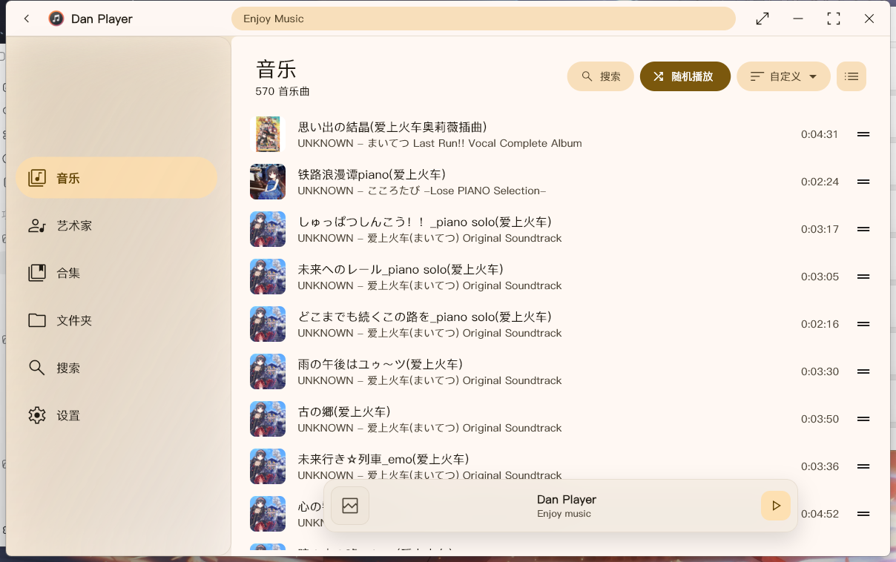
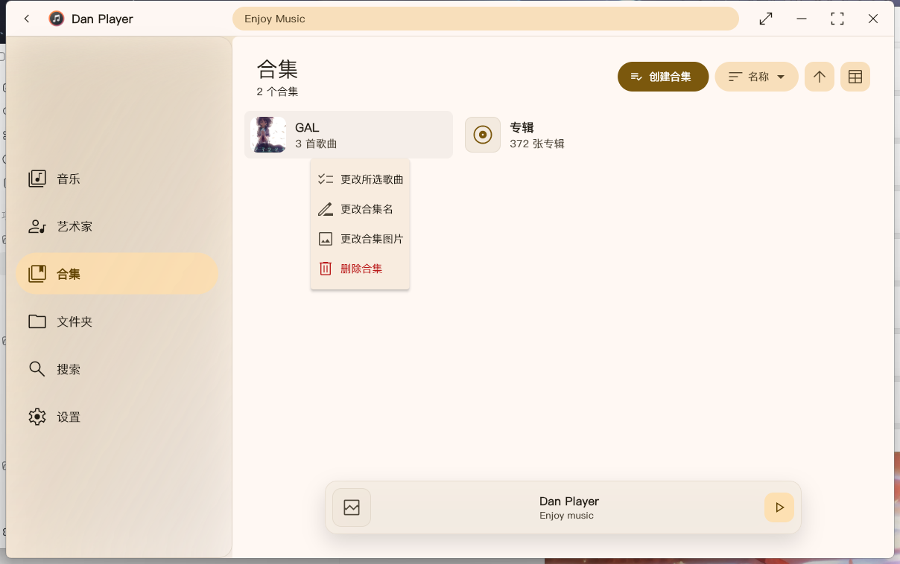
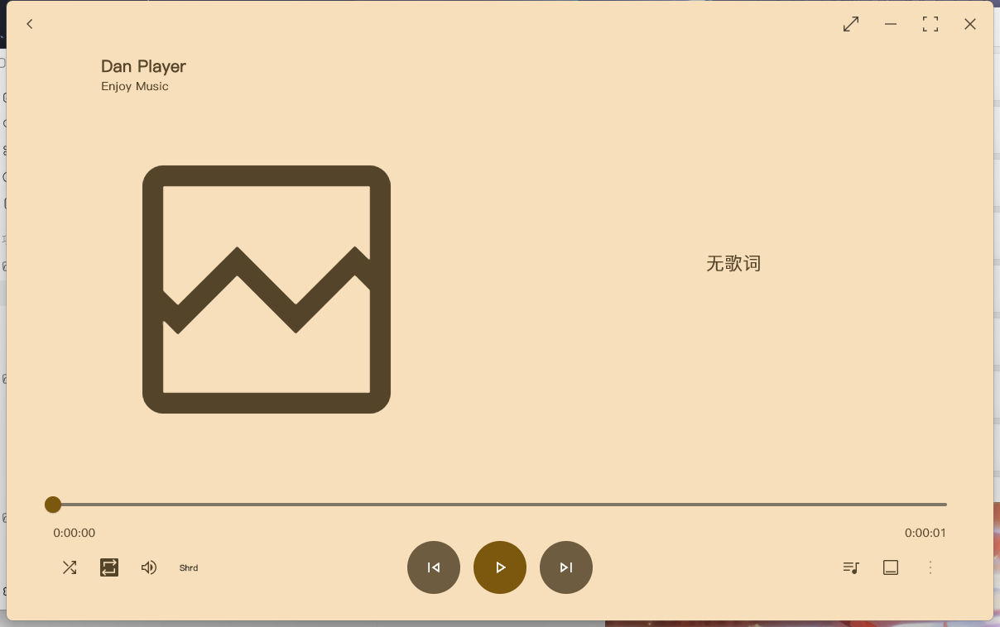

# Dan Player

Dan Player 是一个面向 Windows x64 的本地音乐播放器，基于 Flutter、Rust 和 BASS 构建。这个分支从 Coriander Player 修改而来，重点优化了本地曲库管理、文件名优先显示、中文排序、合集管理、桌面歌词和整体界面观感。

> 当前版本：26.0.1
> 支持平台：Windows x64

## 下载

前往 [Releases](https://github.com/DanRuguo/dan_player/releases/latest) 下载最新 Windows 包。

解压后运行 `Dan Player.exe` 即可。发布包内已经包含播放器本体、BASS 运行库和编译后的 `desktop_lyric` 桌面歌词组件。

## 界面预览

### 音乐主页



音乐主页会扫描本地曲库，展示歌曲封面、文件名优先的标题、艺术家/专辑信息和时长。顶部提供搜索、随机播放、自定义排序、升降序切换和列表视图控制。

### 合集管理



合集用于替代原先容易混淆的歌单入口。用户可以创建合集、修改合集名、修改合集图片、调整合集内歌曲并删除合集；合集只维护本地索引，不复制音乐文件。

### 正在播放



正在播放页提供大封面、歌词区域、进度条、播放模式、随机播放、音量和播放队列入口。桌面歌词组件会随播放器一起发布。

## 26.0.1 主要变化

- 完整改名为 Dan Player，包括窗口标题、应用图标、版本信息、GitHub 仓库链接、问题反馈和检查更新入口。
- 歌曲列表优先显示文件名，避免标签标题混乱影响本地曲库浏览；歌词搜索仍保留原始歌曲信息用于匹配。
- 名称排序改为按文件名排序，并针对中文使用拼音顺序，中文歌曲不再按 Unicode 顺序乱排。
- 新增“自定义排序”，支持拖拽歌曲顺序，并将索引保存在本地；索引损坏或歌曲文件缺失时会自动恢复和清理。
- 新增“合集”入口，支持创建、编辑、删除合集，以及在更改所选歌曲时搜索歌曲。
- 支持右键编辑歌曲信息，可修改文件名、标题名、艺术家名、专辑名和专辑图片，并同步更新本地索引。
- 重写随机播放逻辑：每轮生成随机播放队列，同一轮内避免频繁重复；用户手动切歌后会从当前歌曲所在位置继续队列。
- 新增设置中的“歌词API”管理，可自定义在线歌词接口、打开窗口时自动测试连通性、清空接口前二次确认，并支持备份/加载本地 API 备份文件。
- 优化深色主题、标题栏、左侧毛玻璃导航、按钮图标、间距和动画细节。
- 嵌入授权 PingFang 字体，主程序和桌面歌词在不同设备上保持一致字体效果。
- `desktop_lyric` 源码已放入 `third_party/desktop_lyric`，发布包同时包含其编译产物。

## 功能概览

- 本地音乐文件夹扫描和索引。
- 文件名优先显示与按文件名排序。
- 标题、艺术家、专辑、创建时间、修改时间、自定义排序。
- 合集管理和合集内排序。
- 搜索歌曲、艺术家、专辑和文件夹。
- 本地歌词优先或在线歌词优先。
- 自定义歌词 API、连通性提示、API 备份与本地备份加载。
- LRC、逐字歌词和间奏动画显示。
- 桌面歌词窗口。
- 歌曲元数据编辑。
- 深色/浅色主题、动态主题和系统主题跟随。

## 支持格式

播放器依赖 BASS 进行播放，常见音频格式包括：

- mp3, mp2, mp1
- flac
- wav, wave
- ogg, opus
- aac, m4a
- wma
- ape
- dsf, dff
- mpc
- mid
- wv

内嵌歌词支持常见标签格式；其他格式可使用同目录 LRC 文件或在线歌词匹配。

## 快捷键

当页面中的文本框没有处于输入状态时，可以使用：

- `Esc`：返回上一级
- `Space`：播放 / 暂停
- `Ctrl + Left`：上一首
- `Ctrl + Right`：下一首

## 编译

需要准备 Flutter Windows 桌面开发环境、Rust 工具链和 BASS 运行库。

```powershell
flutter pub get
flutter build windows --release
```

桌面歌词组件位于 `third_party/desktop_lyric`：

```powershell
cd third_party\desktop_lyric
flutter pub get
flutter build windows --release
```

发布时需要将 `desktop_lyric.exe` 及其运行目录放入播放器目录下的 `desktop_lyric/`，并将 BASS 相关 DLL 放入 `BASS/`。

## 致谢

Dan Player 基于开源项目 [Ferry-200/coriander_player](https://github.com/Ferry-200/coriander_player) 修改，感谢原作者提供的播放器基础、曲库结构和歌词体验。

同时感谢以下项目和组件：

- [Ferry-200/desktop_lyric](https://github.com/Ferry-200/desktop_lyric)：桌面歌词组件基础。
- [music_api_dart](https://github.com/Ferry-200/music_api_dart)：在线音乐信息和歌词匹配。
- [BASS](https://www.un4seen.com/bass.html)：音频播放能力。
- [Lofty](https://crates.io/crates/lofty)：音频标签读取与写入。
- [flutter_rust_bridge](https://pub.dev/packages/flutter_rust_bridge)：Flutter 与 Rust 交互。
- [Flutter](https://flutter.dev/) 和 Material Design：桌面 UI 基础。

## 反馈

问题反馈、功能建议和更新检查都指向本仓库：

- [Issues](https://github.com/DanRuguo/dan_player/issues)
- [Releases](https://github.com/DanRuguo/dan_player/releases)
