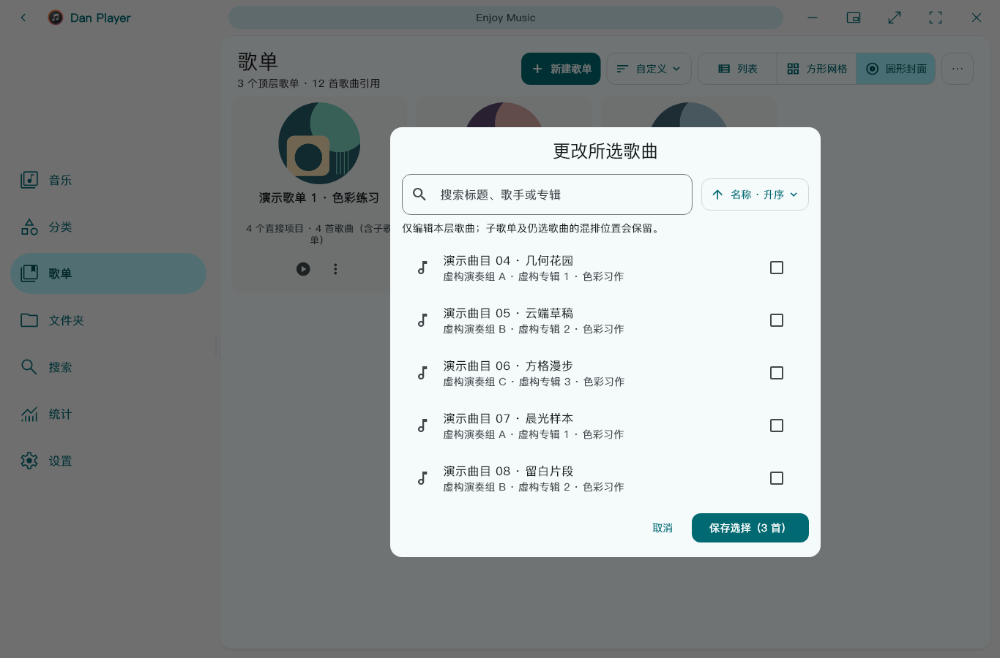
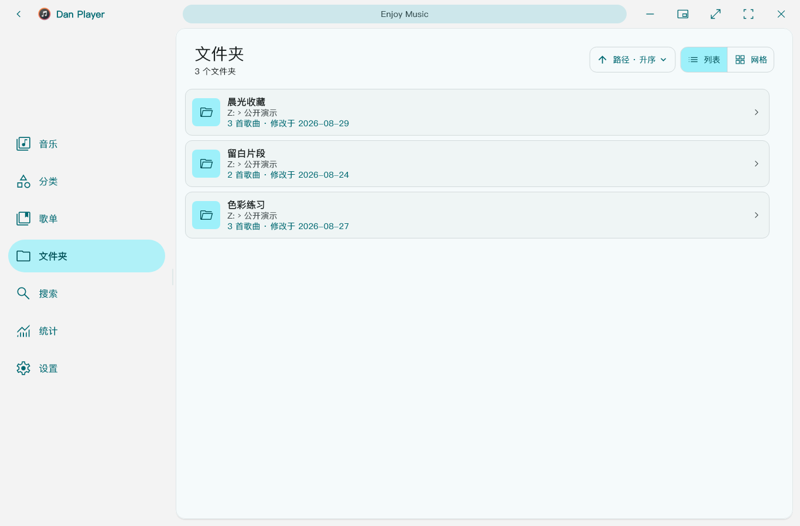
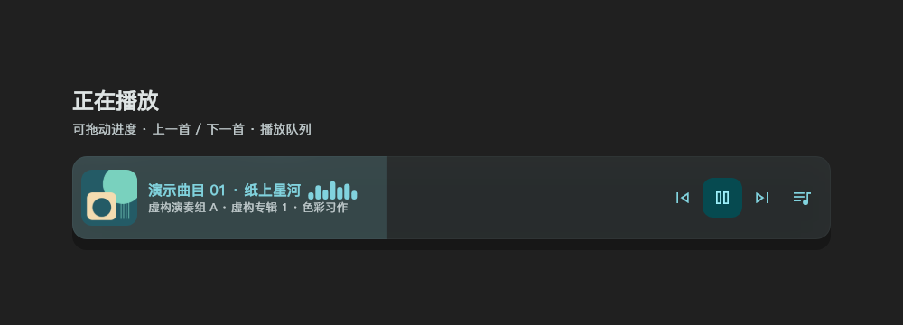
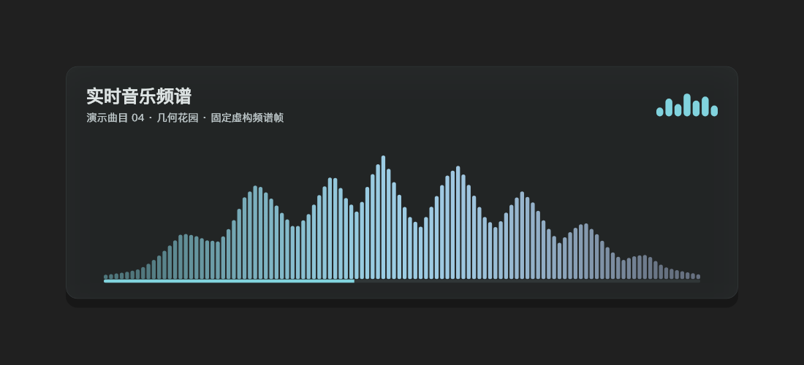
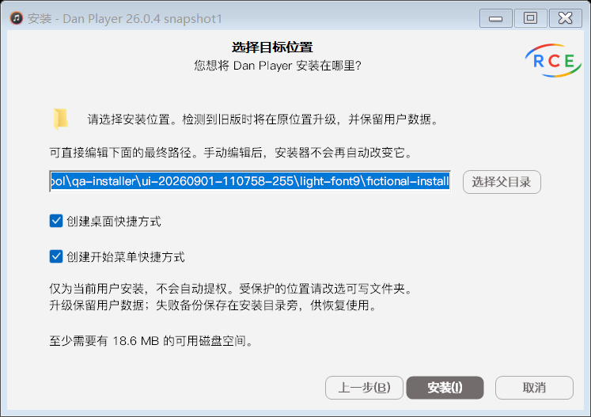
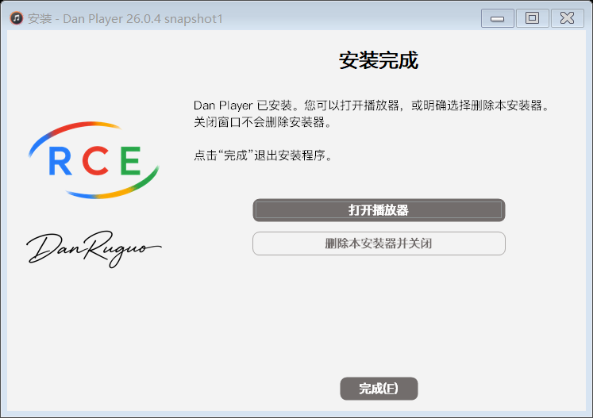

<div align="center">

# Dan Player

面向 Windows x64 的本地与联网音乐播放器<br>
基于 Flutter、Rust 与 BASS，专注曲库管理、歌词体验和流畅的桌面交互。

**稳定版 26.0.4** · Windows x64

[下载正式版](https://github.com/DanRuguo/dan_player/releases/tag/v26.0.4) · [更新说明](docs/release-26.0.4.md) · [功能导览](docs/feature-tour.md) · [28 张安全界面示例](docs/images/README.md)

</div>


Dan Player 从 Coriander Player 修改而来，提供文件名优先显示、中文排序、增量曲库刷新、联网检索、桌面歌词、迷你播放器和 Windows 桌面集成。公开图片全部由生产控件使用虚构数据渲染，不读取真实曲库。

## 下载

**26.0.4 正式版**新增智能歌单、CUE 分轨、队列撤销、M3U8 歌单互通与播放书签，并改进批量操作、联网来源和桌面交互。详见 [更新说明](docs/release-26.0.4.md)。

| 版本 | 适合 | 获取 |
| --- | --- | --- |
| **26.0.4** | 日常使用 | [安装器、便携 ZIP 与 SHA256SUMS](https://github.com/DanRuguo/dan_player/releases/tag/v26.0.4) |
| **26.0.5-snapshot.2** | 体验新功能的预览版 | [签名安装器、便携 ZIP 与 SHA256SUMS](https://github.com/DanRuguo/dan_player/releases/tag/v26.0.5-snapshot.2) |
| 历史版本 | 查看旧版与预览版 | [全部 Release](https://github.com/DanRuguo/dan_player/releases) |

安装器可选择位置、桌面和开始菜单快捷方式；检测到旧版时支持原位升级，手动编辑后的最终路径不会再被自动追加目录。使用便携 ZIP 时，请完整解压后运行 `Dan Player.exe`。包内已包含 BASS 运行库和桌面歌词；26.0.5 预览版由同一 EXE 启动独立歌词进程。

> 自有程序使用 RCEIT.Inc 自签名证书，仍可能出现 Windows 信任或 SmartScreen 提示。26.0.4 更换了签名证书；旧版用户请手动下载本版安装器升级，旧版自动更新的证书校验不会接受新证书。安装器不会自动安装信任证书。

## 界面预览

所有示例均由生产页面与控件离屏渲染，只使用虚构曲目、路径、播放记录和几何封面；不会读取用户曲库、私人歌单或桌面。完整明暗／宽窄版本与复现方法见 [28 张安全界面示例](docs/images/README.md)。

| 歌单与选曲 | 分类与文件夹 |
| --- | --- |
|  |  |
|  |  |

歌单支持嵌套、选曲、封面、拖动排序和列表／网格／圆形视图；旧合集可无损迁移，详细规则见 [歌单合并说明](docs/playlist-unification.md)。分类可按艺术家、专辑、码率、时长、语言、格式或来源浏览。

| 播放条与七音柱 | 48 频带音乐频谱 |
| --- | --- |
|  |  |

播放条支持直接拖动进度、上一首、下一首和播放队列。七音柱与 48 频带图均由生产频谱组件绘制固定虚构帧，渲染时不会启动播放器。

| 设置与主题 | 迷你播放器与歌词 |
| --- | --- |
|  |  |

设置按功能分组，支持中／英／日／韩界面、三态主题、背景、歌词外观与桌面集成。迷你窗口保留当前歌词、译文／下一句和常用播放控制。

### 极简安装器

| 安装位置 | 安装完成 |
| --- | --- |
|  |  |

安装器支持直接编辑最终路径、创建桌面／开始菜单快捷方式和旧版本原位升级。安装器源码、原生安全校验与自动化测试均随项目保存在 [`installer/`](installer/)；Release 额外提供已编译安装包。

## 26.0.5-snapshot.2 预览更新

- 主播放器与桌面歌词共用一个程序入口和运行资源，歌词保留独立进程；修复设置中版本号未同步的问题。
- 新增稳定曲目身份、目录重定位和曲库健康检查，保护旧统计、缺失歌曲及重复歌单位置，支持迁移快照恢复。
- 新增歌词校准、锁定、人工修订与历史版本；主窗口、迷你播放器和桌面歌词共用歌曲偏移。
- 新增播放详情与脱敏诊断，过滤过期播放事件；支持 ReplayGain 曲目／专辑均衡、峰值保护与可选逐曲续播。
- 智能歌单支持听歌记录筛选和播放次数排序；队列新增搜索与可撤销去重。
- 随机与循环模式全局同步、可同时启用，按钮只切换模式；美化歌词与文件夹弹窗、居中标题并改善按钮间距，补齐新功能的多语言提示。
- 统一图标主题、紧凑通知及分档动效，加快返回；重做任务栏预览，修复队列留白和分类首曲封面。
- 支持文件夹自动增量刷新，改进标签同步与备份并发保护，降低大曲库搜索和索引缓存开销。

歌单首页仅保留歌单管理操作，歌曲页继续显示播放模式控件。本次预览发行提供 RCEIT.Inc 签名安装器和便携包；正式版下载仍为 26.0.4。详见 [预览更新说明](docs/release-26.0.5-snapshot.2.md)。

## 26.0.4 更新

- 新增智能歌单、CUE 分轨、播放位置与 A-B 片段书签，队列整理支持最多 10 步撤销。
- 扩展多选菜单，支持批量播放、插队、加入歌单、复制信息及 M3U8 歌单导入导出。
- 统一艺术家、专辑和歌曲菜单，完善封面拖动排序、缺图回退、歌曲删除与增量刷新。
- 统一管理平台直连和自定义歌源，增加酷狗与网易增强 API 适配，支持逐项测试来源能力。
- 修复 QQ 搜索与评论兼容问题，按来源提供评论分类；改进歌词候选选择、短版匹配及失败提示。
- 美化搜索分类、歌词播放按钮与进度条，增加拖动和切歌动效，修复迷你歌词重叠及弹窗错位。
- 新增 Windows 右键快捷任务、单实例和设置内卸载入口，缩短启动画面，改进安装器与缓存迁移。
- 优化本地歌曲响应、异步请求和选择状态，减少卡顿及界面缩放问题。

更多内容见 [更新说明](docs/release-26.0.4.md)，检查范围见 [验证说明](docs/26.0.4-validation.md)。

## 历史更新

<details>
<summary><strong>26.0.3 主要变化</strong></summary>


- 设置重新分组，支持中英日韩界面、自定义字体与背景，以及跟随封面的动态配色。
- 统一歌单与合集，支持嵌套、拖动排序和列表／网格／圆形封面；曲库可切换分栏布局。
- 新增多维分类和播放统计，改进作曲家、语言分类及文件夹信息展示。
- 完善联网搜索、歌词匹配、歌曲信息与封面查找，提供按来源区分的只读评论。
- 完善迷你播放器和桌面歌词，支持横排、竖排、任务栏上方单行及外观自定义。
- 新增托盘播放菜单与任务栏控制，修复悬停闪动、Peek 卡片过小和切歌预览失效。
- 新增保音高倍速与可选歌词动效，优化封面缓存，并提供“不可见时暂停视觉更新”。
- 统一工具栏、图标、圆角和设置排版，修复窗口缩放、弹窗、通知及长歌词显示问题。
- 完善更新下载校验和资源审计，使用虚构数据的真实 UI 渲染图展示功能。

更多图文见 [功能导览](docs/feature-tour.md)，测试与兼容性边界见 [验证说明](docs/26.0.3-validation.md)。历史版本与 Release 保留。

</details>

<details>
<summary><strong>26.0.2 主要变化</strong></summary>


- 改进音频标签读取，支持从更多标签类型和内嵌图片中提取封面、艺术家、作曲家与专辑信息，并跳过损坏图片继续尝试可用封面。
- 新增磁盘封面缓存与 Rust 并行曲库扫描，大型本地曲库的再次加载、刷新和元数据更新更顺畅。
- 新增拼音搜索索引，可用中文、拼音或首字母搜索歌曲、艺术家和专辑。
- 新增 10 段均衡器、睡眠定时、播完当前歌曲后停止，以及播放队列、进度和音量的会话恢复。
- 新增基于实时频谱数据的七音柱播放动画，动画随当前音频的能量变化而起伏。
- 增加曲库刷新入口，播放器内修改标签后会立即更新，外部修改文件信息后也可手动重新扫描。
- 加固曲库索引写入与恢复：采用原子保存和备份恢复，自动处理损坏索引、失效文件以及从其他设备复制来的旧时间戳文件。
- 改进桌面歌词进程通信、BASS 播放器资源释放、插件路径和异常恢复，减少退出残留、启动失败与更新页面卡死。
- 修复点击窗口关闭按钮后需要等待数秒的问题，窗口会立即隐藏并在后台快速完成状态保存与资源释放。

</details>

<details>
<summary><strong>26.0.1 主要变化</strong></summary>


- 完整改名为 Dan Player，包括窗口标题、应用图标、版本信息、GitHub 仓库链接、问题反馈和检查更新入口。
- 歌曲列表优先显示文件名，避免标签标题混乱影响本地曲库浏览；歌词搜索仍保留原始歌曲信息用于匹配。
- 名称排序改为按文件名排序，并针对中文使用拼音顺序，中文歌曲不再按 Unicode 顺序乱排。
- 新增“自定义排序”，支持拖拽歌曲顺序，并将索引保存在本地；索引损坏或歌曲文件缺失时会自动恢复和清理。
- 新增“合集”入口，支持创建、编辑、删除合集，以及在更改所选歌曲时搜索歌曲。
- 支持右键编辑歌曲信息，可修改文件名、标题名、艺术家名、专辑名和专辑图片，并同步更新本地索引。
- 重写随机播放逻辑：每轮生成随机播放队列，同一轮内避免频繁重复；用户手动切歌后会从当前歌曲所在位置继续队列。
- 新增设置中的“歌词API”管理，可自定义在线歌词接口、打开窗口时自动测试连通性、清空接口前二次确认，并支持备份/加载本地 API 备份文件。
- 新增启动开屏遮罩，浅色/深色主题分别显示 RCE logo，并在主界面首帧就绪且至少展示 2 秒后以 0.5 秒淡出，减轻启动黑屏闪烁。
- 优化深色主题、标题栏、左侧毛玻璃导航、按钮图标、间距和动画细节。
- 嵌入授权 PingFang 字体，主程序和桌面歌词在不同设备上保持一致字体效果。
- `desktop_lyric` 源码已放入 `third_party/desktop_lyric`，发布包同时包含其编译产物。

</details>

## 功能概览

| 方向 | 能力 |
| --- | --- |
| 曲库 | 增量扫描、文件名优先、中文／拼音搜索、自定义排序、多维分类、播放与空间统计 |
| 歌单 | 歌曲与子歌单混排、嵌套整理、封面与选曲编辑、旧合集无损迁移 |
| 播放 | BASS、保音高倍速、WASAPI 独占、均衡器、睡眠定时、队列与会话恢复 |
| 歌词 | 本地／在线优先级、LRC 与逐字歌词、翻译、编辑、横排／竖排桌面歌词 |
| 联网 | 多来源检索与播放、候选歌曲信息与专辑封面、来源和单曲均授权时下载 |
| 界面 | 明暗／动态／系统主题、迷你模式、背景、触控手势、任务栏与托盘控制 |

## 支持格式

播放器依赖 BASS 进行播放，常见音频格式包括：

- mp3, mp2, mp1
- flac
- wav, wave
- ogg, opus
- aac, m4a
- wma
- ape
- dsf, dff
- mpc
- mid
- wv

内嵌歌词支持常见标签格式；其他格式可使用同目录 LRC 文件或在线歌词匹配。

## 快捷键

右上角键盘按钮或 `F1` 可查看说明。快捷键仅作用于当前应用，不注册系统全局热键；输入框/输入法编辑和控件自身按键优先，避免打字空格、文本选择或滑块操作被抢走：

- `Esc`：关闭弹窗；否则还原迷你播放器、退出全屏或返回上一级
- `Space`：播放 / 暂停
- `Ctrl + Left`：上一首
- `Ctrl + Right`：下一首
- `Left` / `Right`：后退 / 快进 5 秒
- `Ctrl + Down` / `Ctrl + Up`：播放器音量减少 / 增加 5%，不修改 Windows 系统音量
- `Ctrl + M`：切换迷你播放器
- `F11`：切换全屏
- `F1`：快捷键说明

歌单选中行还支持 `Alt + Up/Down` 调整顺序、`Shift + F10` 打开菜单、`F2` 重命名歌单和 `Delete` 移除记录；删除子树仍会确认，音频源文件不受影响。

触摸屏还可以使用：

- 长按歌曲：打开与鼠标右键一致、并按本地/联网来源区分的菜单。
- 从屏幕左边缘向右滑：返回上一页；在首页窄窗口中打开导航栏。
- 在正在播放页的封面上横向滑动：切换上一首或下一首。

## 编译

需要准备 Flutter Windows 桌面开发环境、Rust 工具链和 BASS 运行库。

```powershell
flutter pub get
flutter build windows --release
```

本仓库的离线开发环境约定把工具放在仓库外的工作区 `tool/` 下，例如 `<workspace>/tool/flutter`，不会把 Flutter 或缓存写入项目源码目录。

桌面歌词模块位于 `third_party/desktop_lyric`，已编入主程序。其独立项目只作为开发测试壳，必要时可单独构建：

```powershell
cd third_party\desktop_lyric
flutter pub get
flutter build windows --release
```

26.0.5-snapshot.2 起，桌面歌词由 `Dan Player.exe --desktop-lyric` 运行于独立进程；发布包共用一套 Flutter 资源，不分发独立 `desktop_lyric.exe`。BASS 相关 DLL 仍放在 `BASS/`。

本地完整流程可直接运行 `scripts/build_windows_release.ps1`，依次核对版本、构建统一程序、签名、校验 BASS 官方运行库并组装便携包，结果写入工作区 `dist/` 下的新目录，不覆盖旧包。已有依赖可用 `-NoRestore`，缓存完整时可加 `-OfflineRuntime`；`-SkipSigning` 生成未签名包，`-SkipPackaging` 仅构建。单独组装已有产物：

```powershell
.\scripts\prepare_bass_runtime.ps1
.\scripts\assemble_windows_release.ps1
```

便携包包含共享 Flutter 资源、BASS、原始签名的 Microsoft x64 CRT 和许可证说明，并生成包内文件清单及 ZIP 的 `SHA256SUMS`。联网播放要求 BASS 2.4.18 或更新版；准备脚本固定官方版本与哈希，下载内容变化会报错，不会默默接受更新。BASS 的商业使用及公开分发需另行核对其许可，DLL 不会被改签成 RCEIT.Inc。

Windows CI 执行分析、测试、主程序及歌词测试壳构建，再组装未签名便携包；只上传构建 artifact，不会发布 GitHub Release。发行时提供对应源代码与许可证；本次预览提供签名安装器、便携 ZIP 和校验文件。预览 Release 不更改最新稳定版。安装器同名 `.exe.sha256` 文件必须在签名之后生成，记录上传资产的文件名，而非本地子目录。

开发测试可在启动进程前设置绝对路径环境变量 `DAN_PLAYER_DATA_DIR`，将索引、设置和缓存隔离到工作区。指定此变量时不会迁移或导入用户原有文档目录曲库；正常启动不设置该变量即可沿用原来的数据。

## Windows 代码签名

Windows 版本资源中的公司名为 `RCEIT.Inc`。当前本地开发证书主题为 `CN=RCEIT.Inc`，有效期为 2026-09-05 至 2036-09-05，指纹为 `492AD4FCB49C9898B6B98251D4FE9FE78BDB56C1`。私钥可导出，保存在构建机的 Windows 个人证书库；公钥证书、加密 PFX 备份和本机配置均在仓库外的 `tool/signing/`，不会提交到 Git。本机初始化环境会读取 `tool/signing/active-certificate.json` 并设置 `RCEIT_SIGNING_THUMBPRINT`；其他构建环境应显式指定所用证书指纹。

此证书替代旧机 2026-08-27 至 2027-08-27 的自签名证书。即使主题相同，新旧证书的密钥和指纹仍不同；旧版切换到新证书版本需要手动运行新安装器。运行时仍要求 Windows 信任签名并核对实际证书，不因公司名相同而放行。

构建、签名并组装主播放器和桌面歌词：

```powershell
.\scripts\build_windows_release.ps1
```

对已有构建产物签名，或用 `-Path` 指定其他由本项目生成的 EXE/DLL：

```powershell
.\scripts\sign_windows_release.ps1
```

从已审计的便携目录生成签名安装器：

```powershell
.\scripts\build_windows_installer.ps1 -PayloadDirectory 'D:\path\to\portable' -OutputRoot '..\dist' -Sign
```

该步骤先签安装器自有辅助文件，再生成载荷清单，最后签 Setup 并输出其 `.exe.sha256`；示例将新产物写入工作区 `dist/` 的独立目录，不修改便携目录或历史发布包。

该证书是本地自签名代码签名证书，可验证文件签名和发布者主题，默认不受 Windows 信任。公共信任通常需要向受信任的 CA 或签名服务申请、核验发布者身份并付费；公共信任与 SmartScreen 文件信誉是两项不同的判断，购买证书不保证新文件立即消除提示。参见 [Microsoft 代码签名选项](https://learn.microsoft.com/en-us/windows/apps/package-and-deploy/code-signing-options) 和 [SmartScreen 信誉说明](https://learn.microsoft.com/en-us/windows/apps/package-and-deploy/smartscreen-reputation)。不要提交 PFX 或私钥。

## 致谢

Dan Player 基于开源项目 [Ferry-200/coriander_player](https://github.com/Ferry-200/coriander_player) 修改，感谢原作者提供的播放器基础、曲库结构和歌词体验。

同时感谢以下项目和组件：

- [Ferry-200/desktop_lyric](https://github.com/Ferry-200/desktop_lyric)：桌面歌词组件基础。
- [music_api_dart](https://github.com/Ferry-200/music_api_dart)：在线音乐信息和歌词匹配。
- [BASS](https://www.un4seen.com/bass.html)：音频播放能力。
- [Lofty](https://crates.io/crates/lofty)：音频标签读取与写入。
- [flutter_rust_bridge](https://pub.dev/packages/flutter_rust_bridge)：Flutter 与 Rust 交互。
- [Flutter](https://flutter.dev/) 和 Material Design：桌面 UI 基础。

26.0.3–26.0.4 的联网模型、歌词交互、自定义歌源信息架构、触控与播放器细节还调研了 [ZeroBit Player 固定提交](https://github.com/Empty-57/ZeroBit-Player/tree/e47d34fb5c946a6cf10041377b15eb6f089f5d28)（GPL-3.0）、[ECHO 固定提交](https://github.com/Moekotori/ECHO/tree/45ea979d18da08234307b13c215f56abe3c00556)（LGPL-3.0-only）、[Melodify](https://github.com/LPFVG/Melodify)、[LyciaMusic](https://github.com/Billy636/LyciaMusic)、[Mineradio](https://github.com/XxHuberrr/Mineradio)、[LX Music Desktop](https://github.com/lyswhut/lx-music-desktop) 和 [QueMusic](https://github.com/bronekox/quemusic)。[`go-music-api` 固定提交](https://github.com/guohuiyuan/go-music-api/tree/bacdfbe6cf6a5ba7331463d2039e3aac915c627f)（AGPL-3.0）只作为用户自行部署的兼容目标。Dan Player 没有复制这些项目的实现，也不捆绑其服务、远程脚本、平台账号或登录凭据；各项目代码仍受其各自许可证约束。

## 反馈

问题反馈、功能建议和更新检查都指向本仓库：

- [Issues](https://github.com/DanRuguo/dan_player/issues)
- [Releases](https://github.com/DanRuguo/dan_player/releases)
