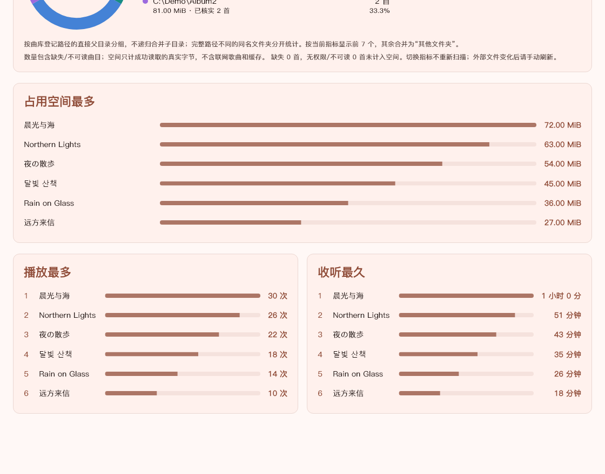

# Dan Player

Windows x64 音乐播放器，基于 Flutter、Rust 与 BASS，支持本地曲库、联网音乐、桌面歌词和四语言界面。

[稳定版 26.0.4](https://github.com/DanRuguo/dan_player/releases/tag/v26.0.4) · [候选版 26.0.5-snapshot.3](https://github.com/DanRuguo/dan_player/releases/tag/v26.0.5-snapshot.3) · [更新记录](https://github.com/DanRuguo/dan_player/releases) · [反馈](https://github.com/DanRuguo/dan_player/issues)


## 功能

- 本地与联网播放，CUE 分轨、均衡器、响度均衡、逐曲续播和 A–B 循环。
- 艺术家、专辑、格式、文件夹分类；嵌套歌单、智能歌单、M3U8 导入导出。
- 个人评分、标签、播放书签、曲库健康检查与回收站。
- 歌词匹配、编辑、校准，桌面歌词与迷你播放器。
- 随封面变色的明暗主题，中文、英语、日语、韩语界面。
- 听歌时段、曲库构成、文件占用和歌曲排行可视化。

| 歌单 | 设置 |
| --- | --- |
|  |  |

预览使用实际界面组件与虚构数据。[更多界面与功能预览](docs/images/README.md) 包含明暗主题、宽窄窗口和歌词等示例。



## 安装与使用

Release 提供安装器、便携 ZIP 和校验文件。安装器支持原位升级，成功后清理临时回滚资料；便携包完整解压后运行 `Dan Player.exe`。桌面歌词由同一程序启动独立进程。

自有程序使用 RCEIT.Inc 自签名证书，Windows 可能显示信任提示；安装器不会自动安装信任证书。旧签名版本升级请手动下载新安装器。

`Space` 播放／暂停，`Ctrl + Left/Right` 切歌，`Left/Right` 跳转 5 秒，`Ctrl + M` 切换迷你播放器，`F11` 全屏，`F1` 查看快捷键。

### 曲库与个人整理

导入音乐文件或文件夹后，可从音乐、分类和歌单页浏览。歌单支持嵌套组织、拖动排序和移入其他歌单；多选项以加粗边框突出显示。

“分类 → 个人整理 → 歌曲”只显示评过分或添加过个人标签的歌曲，支持日期、评分、标签筛选和排序。个人评分与标签保存在播放器资料中，不写入音乐文件；“编辑信息”和“批量编辑标签”用于修改文件中的音乐元数据，保存前请核对变更预览。

播放书签可保存单个时间点或时间段，在“全库书签”集中查找、播放和编辑。歌词详情页支持沉浸队列；可在设置的外观部分关闭播放条频谱音柱，保留进度条。播放详情将输出链路、音频处理和诊断状态分组展示，并支持导出脱敏诊断。

### 数据与反馈

设置中的“备份与恢复”提供本地资料备份入口。升级程序与备份个人资料是不同操作，安装目录中的程序文件不能替代曲库、歌单和设置备份。

遇到问题时，请在反馈中注明播放器版本、界面语言、窗口大小或显示缩放、复现步骤，以及相关截图。播放问题可附脱敏诊断；请不要上传私人音乐文件、凭据或完整个人目录。

自定义歌源见 [接口说明](docs/custom-music-source-api.md) 和 [go-music-api 配置示例](docs/examples/go-music-api-jamendo.json)。示例中的服务地址需要替换为自己部署的地址。

## 源码与构建

| 目录 | 用途 |
| --- | --- |
| `lib/` | 界面、曲库和播放服务 |
| `rust/`、`rust_builder/` | 标签处理与 Flutter/Rust 桥接 |
| `windows/`、`installer/` | Windows 集成与安装器 |
| `third_party/` | 随附组件及其许可证 |
| `test/`、`test_driver/` | 自动化测试 |
| `scripts/` | 构建、校验与发布脚本 |
| `docs/` | 接口说明、示例和界面图片 |

需要 Flutter、Rust 和 Visual Studio 桌面 C++ 工作负载。Dart 约束见 `pubspec.yaml`，依赖解析结果见 `pubspec.lock` 与 `rust/Cargo.lock`。

### 调试与测试

在仓库根目录执行，使用独立资料目录，避免调试影响日常曲库和设置：

```powershell
$env:DAN_PLAYER_DATA_DIR = [IO.Path]::GetFullPath((Join-Path (Get-Location).Path '../tool/qa-data/readme-debug'))
flutter pub get
flutter run -d windows
```

运行播放器需要准备 BASS 运行库；相关脚本为 `scripts/prepare_bass_runtime.ps1` 与 `scripts/prepare_bass_fx_runtime.ps1`。本机 SDK、运行库缓存和签名配置的实际路径集中记录在源码仓库外的 `DEVELOPMENT.md`。

修改后优先运行对应组件测试；以下命令示例覆盖统计和详情排版：

```powershell
flutter test test/statistics_visualization_test.dart test/detail_diagnostics_layout_test.dart --no-pub
.\scripts\verify_interaction_regressions.ps1
```

界面预览使用真实 Flutter 组件和隔离的虚构资料。`scripts/render_public_ui.ps1` 生成公开页面预览；渲染测试覆盖语言、窗口宽度和文字缩放，不能代替真实设备上的音频输出与 Windows 桌面集成检查。

### 构建与发布

本项目发布脚本使用工作区布局：源码在 `dan_player/`，同级 `tool/` 放置 Flutter、Rust 工具链和缓存，`dist/` 接收产物。`build_windows_release.ps1` 会检查依赖、运行发布门禁、构建 Windows 程序并校验字体与运行库。

```powershell
# 使用上述工作区布局，在源码仓库运行；无签名证书时：
.\scripts\build_windows_release.ps1 -SkipSigning
```

`-SkipPackaging` 跳过便携包组装；`-NoRestore` 使用已恢复的依赖。正式签名需要单独配置证书。安装器由 `scripts/build_windows_installer.ps1` 构建，便携包和安装器分别通过 `verify_local_release.ps1`、`verify_windows_installer.ps1` 核验。

发布前核对源码提交、测试收据、产物 SHA-256 和签名；预览版保持 prerelease，不替换稳定版 Latest。发布包包含所需许可证，不附带历史开发笔记。

README 维护对用户和开发者有用的长期信息；本机路径、调试状态、当前产物和实测结果只维护在本地 `DEVELOPMENT.md`。签名私钥、个人资料、工具缓存、临时日志与历史 QA 不进入源码仓库。

## 许可证

本项目按 [LICENSE](LICENSE) 分发。第三方组件保留各自许可；BASS 的使用与分发须遵守其官方许可。

## 致谢

Dan Player 基于开源项目 [Ferry-200/coriander_player](https://github.com/Ferry-200/coriander_player) 修改，感谢原作者提供的播放器基础、曲库结构和歌词体验。

同时感谢以下项目和组件：

- [Ferry-200/desktop_lyric](https://github.com/Ferry-200/desktop_lyric)：桌面歌词组件基础。
- [music_api_dart](https://github.com/Ferry-200/music_api_dart)：在线音乐信息和歌词匹配。
- [BASS](https://www.un4seen.com/bass.html)：音频播放能力。
- [Lofty](https://crates.io/crates/lofty)：音频标签读取与写入。
- [flutter_rust_bridge](https://pub.dev/packages/flutter_rust_bridge)：Flutter 与 Rust 交互。
- [Flutter](https://flutter.dev/) 和 Material Design：桌面 UI 基础。
