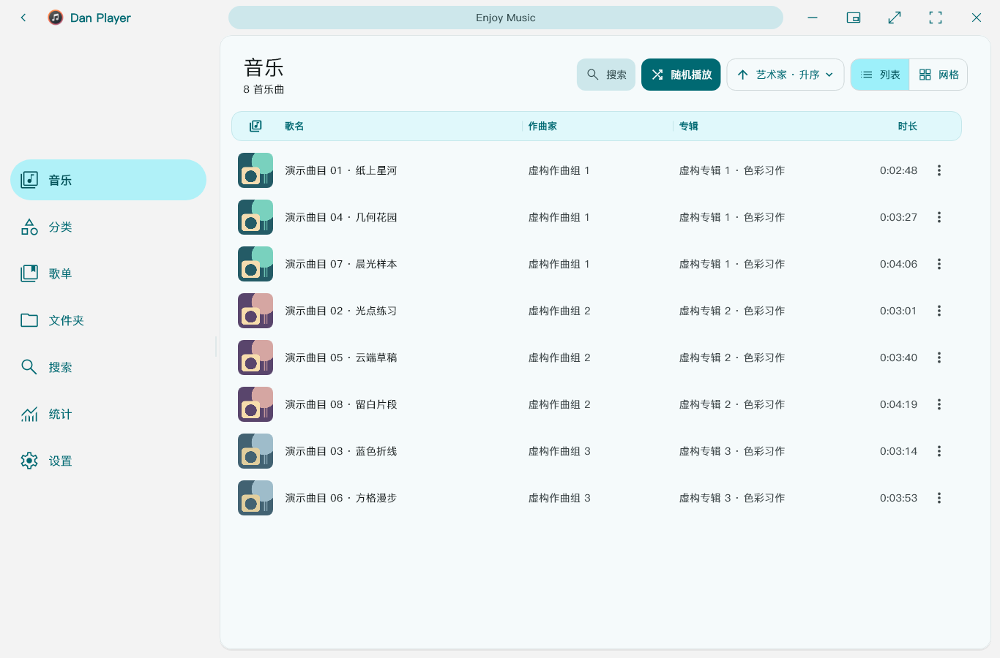
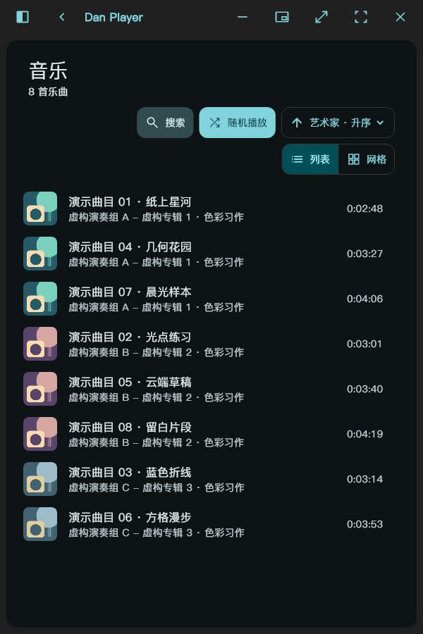
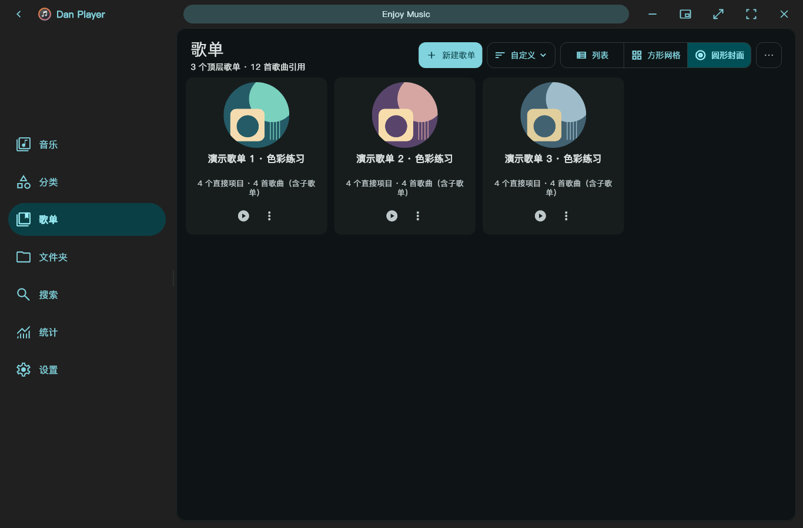
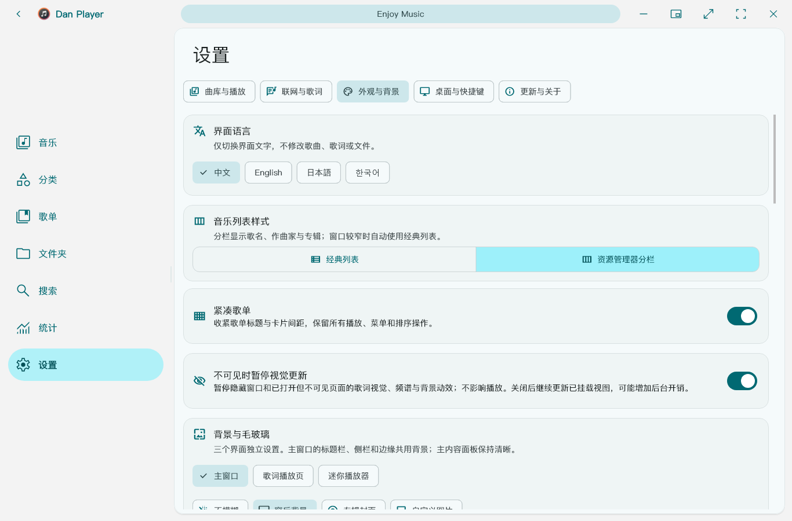
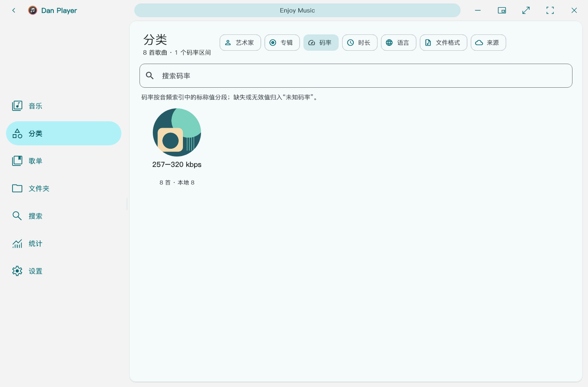
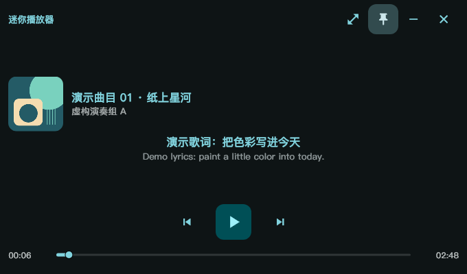

# Dan Player

Dan Player 是一个面向 Windows x64 的本地与联网音乐播放器，基于 Flutter、Rust 和 BASS 构建。这个分支从 Coriander Player 修改而来，重点优化了曲库管理、文件名优先显示、中文排序、联网检索、歌词体验、桌面歌词和整体界面观感。

> 预览版：26.0.4 snapshot1 · 稳定版：26.0.3
> 支持平台：Windows x64

[特色功能导览](docs/feature-tour.md) · [全部 18 张安全界面示例](docs/images/README.md) · [最新 Release](https://github.com/DanRuguo/dan_player/releases/latest)

## 下载

前往 [Releases](https://github.com/DanRuguo/dan_player/releases/latest) 下载最新 Windows 包。

[26.0.4 snapshot1 预览版](https://github.com/DanRuguo/dan_player/releases/tag/v26.0.4-snapshot.1) 提供安装器和便携 ZIP。安装器可选择位置、桌面和开始菜单快捷方式，检测到旧版时支持原位升级；用户直接编辑的最终路径不会再被自动追加目录。历史版本保留，快照不会取代最新稳定版。

使用 ZIP 时，完整解压后运行 `Dan Player.exe`。发布包内已经包含播放器本体、BASS 运行库和编译后的 `desktop_lyric` 桌面歌词组件。本次自有程序使用 RCEIT.Inc 自签名证书，未获得公共 CA 信任，Windows 仍可能提示未知发布者；不会自动安装信任证书。

## 界面预览

以下图片由当前生产 Flutter 页面与控件离屏渲染，曲目、歌单、艺术家、专辑和几何封面全部为虚构演示数据。它们不是用户桌面截图；不读取真实曲库，不展示私人歌单或第三方专辑封面。完整明暗／宽窄示例和复现方法见 [安全界面示例](docs/images/README.md)。

### 音乐主页：明暗与宽窄布局





音乐主页会扫描本地曲库，展示歌曲封面、文件名优先的标题、艺术家/专辑信息和时长。顶部提供搜索、随机播放、自定义排序、升降序切换和列表视图控制。

### 歌单管理



“合集”和“歌单”现在统一为一个“歌单”入口。支持创建时选择歌曲与封面、改名、换封面、更改所选歌曲、列表／网格／圆形视图、拼音及歌曲数量等排序；原“专辑”入口仍可从歌单页进入。

首次读取会把原合集无损合并进歌单树，保留标题、封面路径、时间、重复歌曲及顺序，不按同名合并；已有歌单和嵌套关系保持。原合集文件只读保留，迁移前歌单主文件/备份另存快照，成功迁移后不会反复导入或让已删除歌单复活。读失败时保护为只读并可重读，写失败保留当前会话并可重试。详见 [歌单合并说明](docs/playlist-unification.md)。

### 设置



设置按功能分组，提供中／英／日／韩界面、歌曲列表布局、背景、歌词外观及桌面集成。示例使用实色窗口回退，不启动原生实时毛玻璃或活动播放条；实际正在播放页与桌面歌词功能见下方说明。

### 更多特色：分类与迷你歌词



按创作者、专辑、语言、格式或来源浏览曲库；分类保留证据来源，不把文字推断当作音频识别。



迷你窗口保留当前歌词、译文／下一句和播放控制。还有可持久保存的桌面歌词外观、主题选择器、托盘与歌曲预览，以及分组搜索——见 [图文功能导览](docs/feature-tour.md)。图库全部使用生产控件和虚构数据，不是用户音乐或桌面截图。项目基于 Coriander Player 修改，完整上游与依赖署名保留在下方“致谢”。

## 26.0.4 snapshot1 主要变化

- 新增极简安装器，支持自选路径、快捷方式及覆盖升级。
- 播放条支持拖动进度，新增上一首、下一首与播放队列。
- 主题可选择跟随系统、明亮或深色，记住选择并实时同步。
- 简化歌单详情按钮，优化托盘字体、图标及桌面歌曲预览。
- 新增曲库增量刷新，改善歌曲标签编辑兼容性。
- 更新前询问是否下载，提供预览版开关及完整安装器升级。

这是预览版本；测试与已知边界见 [验证说明](docs/26.0.4-snapshot.1-validation.md)，更新行为见 [更新说明](docs/application-updates.md)。

## 26.0.3 主要变化

- 设置重新分组，支持中英日韩界面、自定义字体与背景，以及跟随封面的动态配色。
- 统一歌单与合集，支持嵌套、拖动排序和列表／网格／圆形封面；曲库可切换分栏布局。
- 新增多维分类和播放统计，改进作曲家、语言分类及文件夹信息展示。
- 完善联网搜索、歌词匹配、歌曲信息与封面查找，提供按来源区分的只读评论。
- 完善迷你播放器和桌面歌词，支持横排、竖排、任务栏上方单行及外观自定义。
- 新增托盘播放菜单与任务栏控制，修复悬停闪动、Peek 卡片过小和切歌预览失效。
- 新增保音高倍速与可选歌词动效，优化封面缓存，并提供“不可见时暂停视觉更新”。
- 统一工具栏、图标、圆角和设置排版，修复窗口缩放、弹窗、通知及长歌词显示问题。
- 完善更新下载校验和资源审计，使用虚构数据的真实 UI 渲染图展示功能。

更多图文见 [功能导览](docs/feature-tour.md)，测试与兼容性边界见 [验证说明](docs/26.0.3-validation.md)。历史版本与 Release 保留。

## 26.0.2 主要变化

- 改进音频标签读取，支持从更多标签类型和内嵌图片中提取封面、艺术家、作曲家与专辑信息，并跳过损坏图片继续尝试可用封面。
- 新增磁盘封面缓存与 Rust 并行曲库扫描，大型本地曲库的再次加载、刷新和元数据更新更顺畅。
- 新增拼音搜索索引，可用中文、拼音或首字母搜索歌曲、艺术家和专辑。
- 新增 10 段均衡器、睡眠定时、播完当前歌曲后停止，以及播放队列、进度和音量的会话恢复。
- 新增基于实时频谱数据的七音柱播放动画，动画随当前音频的能量变化而起伏。
- 增加曲库刷新入口，播放器内修改标签后会立即更新，外部修改文件信息后也可手动重新扫描。
- 加固曲库索引写入与恢复：采用原子保存和备份恢复，自动处理损坏索引、失效文件以及从其他设备复制来的旧时间戳文件。
- 改进桌面歌词进程通信、BASS 播放器资源释放、插件路径和异常恢复，减少退出残留、启动失败与更新页面卡死。
- 修复点击窗口关闭按钮后需要等待数秒的问题，窗口会立即隐藏并在后台快速完成状态保存与资源释放。

## 26.0.1 主要变化

- 完整改名为 Dan Player，包括窗口标题、应用图标、版本信息、GitHub 仓库链接、问题反馈和检查更新入口。
- 歌曲列表优先显示文件名，避免标签标题混乱影响本地曲库浏览；歌词搜索仍保留原始歌曲信息用于匹配。
- 名称排序改为按文件名排序，并针对中文使用拼音顺序，中文歌曲不再按 Unicode 顺序乱排。
- 新增“自定义排序”，支持拖拽歌曲顺序，并将索引保存在本地；索引损坏或歌曲文件缺失时会自动恢复和清理。
- 新增“合集”入口，支持创建、编辑、删除合集，以及在更改所选歌曲时搜索歌曲。
- 支持右键编辑歌曲信息，可修改文件名、标题名、艺术家名、专辑名和专辑图片，并同步更新本地索引。
- 重写随机播放逻辑：每轮生成随机播放队列，同一轮内避免频繁重复；用户手动切歌后会从当前歌曲所在位置继续队列。
- 新增设置中的“歌词API”管理，可自定义在线歌词接口、打开窗口时自动测试连通性、清空接口前二次确认，并支持备份/加载本地 API 备份文件。
- 新增启动开屏遮罩，浅色/深色主题分别显示 RCE logo，并在主界面首帧就绪且至少展示 2 秒后以 0.5 秒淡出，减轻启动黑屏闪烁。
- 优化深色主题、标题栏、左侧毛玻璃导航、按钮图标、间距和动画细节。
- 嵌入授权 PingFang 字体，主程序和桌面歌词在不同设备上保持一致字体效果。
- `desktop_lyric` 源码已放入 `third_party/desktop_lyric`，发布包同时包含其编译产物。

## 功能概览

- 本地音乐文件夹扫描和索引。
- 文件名优先显示与按文件名排序。
- 标题、艺术家、专辑、创建时间、修改时间、自定义排序。
- 统一歌单管理、封面/选曲编辑、原合集无损迁移及顺序保留。
- 歌曲与子歌单混排、嵌套歌单、拖拽整理及深度优先顺序播放。
- 搜索歌曲、艺术家、专辑和文件夹。
- 联网搜索、播放、按来源能力下载，以及将联网歌曲加入总乐库。
- 本地歌词优先或在线歌词优先。
- 自定义歌词 API、连通性提示、API 备份与本地备份加载。
- LRC、逐字歌词、翻译歌词、间奏动画和本地 LRC 编辑。
- 横排/竖排桌面歌词、可选弹性滚动和倍速同步。
- 保音高倍速、WASAPI 独占输出、可选托盘后台播放和任务栏播放控制。
- 设置分组、三场景独立自定义图片背景与可选轻缓动态。
- 播放/空间/语种统计、歌曲详情和 48 频带全宽频谱。
- Windows 触控滚动、长按和滑动手势。
- 应用内快捷键、同一播放会话的迷你模式和可选窗口置顶。
- GitHub 稳定版自动检查与安全下载。
- 歌曲元数据编辑，以及联网搜索候选信息与专辑封面。
- 深色/浅色主题、动态主题和系统主题跟随。

## 支持格式

播放器依赖 BASS 进行播放，常见音频格式包括：

- mp3, mp2, mp1
- flac
- wav, wave
- ogg, opus
- aac, m4a
- wma
- ape
- dsf, dff
- mpc
- mid
- wv

内嵌歌词支持常见标签格式；其他格式可使用同目录 LRC 文件或在线歌词匹配。

## 快捷键

右上角键盘按钮或 `F1` 可查看说明。快捷键仅作用于当前应用，不注册系统全局热键；输入框/输入法编辑和控件自身按键优先，避免打字空格、文本选择或滑块操作被抢走：

- `Esc`：关闭弹窗；否则还原迷你播放器、退出全屏或返回上一级
- `Space`：播放 / 暂停
- `Ctrl + Left`：上一首
- `Ctrl + Right`：下一首
- `Left` / `Right`：后退 / 快进 5 秒
- `Ctrl + Down` / `Ctrl + Up`：播放器音量减少 / 增加 5%，不修改 Windows 系统音量
- `Ctrl + M`：切换迷你播放器
- `F11`：切换全屏
- `F1`：快捷键说明

歌单选中行还支持 `Alt + Up/Down` 调整顺序、`Shift + F10` 打开菜单、`F2` 重命名歌单和 `Delete` 移除记录；删除子树仍会确认，音频源文件不受影响。

触摸屏还可以使用：

- 长按歌曲：打开与鼠标右键一致、并按本地/联网来源区分的菜单。
- 从屏幕左边缘向右滑：返回上一页；在首页窄窗口中打开导航栏。
- 在正在播放页的封面上横向滑动：切换上一首或下一首。

## 编译

需要准备 Flutter Windows 桌面开发环境、Rust 工具链和 BASS 运行库。

```powershell
flutter pub get
flutter build windows --release
```

本仓库的离线开发环境约定把工具放在仓库外的工作区 `tool/` 下，例如 `<workspace>/tool/flutter`，不会把 Flutter 或缓存写入项目源码目录。

桌面歌词组件位于 `third_party/desktop_lyric`：

```powershell
cd third_party\desktop_lyric
flutter pub get
flutter build windows --release
```

发布时需要将 `desktop_lyric.exe` 及其运行目录放入播放器目录下的 `desktop_lyric/`，并将 BASS 相关 DLL 放入 `BASS/`。

本地完整流程可直接运行 `scripts/build_windows_release.ps1`，依次构建两个程序、签名、校验 BASS 官方运行库并组装便携包，结果写入工作区 `dist/` 下的新目录，不覆盖旧包。已有依赖可用 `-NoRestore`，缓存完整时可加 `-OfflineRuntime`；`-SkipSigning` 生成未签名包，`-SkipPackaging` 仅构建。单独组装已有产物：

```powershell
.\scripts\prepare_bass_runtime.ps1
.\scripts\assemble_windows_release.ps1
```

便携包包含两个程序各自的 Flutter 资源、BASS、原始签名的 Microsoft x64 CRT 和许可证说明，并生成包内文件清单及 ZIP 的 `SHA256SUMS`。联网播放要求 BASS 2.4.18 或更新版；准备脚本固定官方版本与哈希，下载内容变化会报错，不会默默接受更新。BASS 的商业使用及公开分发需另行核对其许可，DLL 不会被改签成 RCEIT.Inc。

Windows CI 执行分析、测试、两个程序的构建及未签名便携包组装，只上传构建 artifact，不会发布 GitHub Release。发行时提供对应源代码与许可证，并上传 Windows 安装器、便携 ZIP 和校验文件。预览 Release 仅在启用预览更新时参与检查，不更改最新稳定版。安装器的同名 `.exe.sha256` 文件必须在签名之后生成，记录上传资产的文件名，而非本地子目录。

开发测试可在启动进程前设置绝对路径环境变量 `DAN_PLAYER_DATA_DIR`，将索引、设置和缓存隔离到工作区。指定此变量时不会迁移或导入用户原有文档目录曲库；正常启动不设置该变量即可沿用原来的数据。

## Windows 代码签名

Windows 版本资源中的公司名为 `RCEIT.Inc`。本地开发证书主题为 `CN=RCEIT.Inc`，有效期为 2026-08-27 至 2027-08-27；私钥保存在构建机的 Windows 个人证书库，公开证书保存在仓库外的签名工具目录，不会提交到 Git。

构建、签名并组装主播放器和桌面歌词：

```powershell
.\scripts\build_windows_release.ps1
```

对已有构建产物签名，或用 `-Path` 指定其他由本项目生成的 EXE/DLL：

```powershell
.\scripts\sign_windows_release.ps1
```

从已审计的便携目录生成签名安装器：

```powershell
.\scripts\build_windows_installer.ps1 -PayloadDirectory 'D:\path\to\portable' -Sign
```

该步骤先签安装器自有辅助文件，再生成载荷清单，最后签 Setup 并输出其 `.exe.sha256`；不修改便携目录或历史发布包。

该证书是本地自签名代码签名证书，可验证文件签名和发布者主题，但默认不在其他 Windows 设备的可信根中。正式公开发行若要获得 SmartScreen/系统级公共信任，请改用颁发给 RCEIT.Inc 的 CA 代码签名证书，并通过 `RCEIT_SIGNING_THUMBPRINT` 指定其指纹；不要提交 PFX 或私钥。

## 致谢

Dan Player 基于开源项目 [Ferry-200/coriander_player](https://github.com/Ferry-200/coriander_player) 修改，感谢原作者提供的播放器基础、曲库结构和歌词体验。

同时感谢以下项目和组件：

- [Ferry-200/desktop_lyric](https://github.com/Ferry-200/desktop_lyric)：桌面歌词组件基础。
- [music_api_dart](https://github.com/Ferry-200/music_api_dart)：在线音乐信息和歌词匹配。
- [BASS](https://www.un4seen.com/bass.html)：音频播放能力。
- [Lofty](https://crates.io/crates/lofty)：音频标签读取与写入。
- [flutter_rust_bridge](https://pub.dev/packages/flutter_rust_bridge)：Flutter 与 Rust 交互。
- [Flutter](https://flutter.dev/) 和 Material Design：桌面 UI 基础。

26.0.3 的联网模型、歌词交互、触控与播放器信息架构还调研了 [Melodify](https://github.com/LPFVG/Melodify)、[LyciaMusic](https://github.com/Billy636/LyciaMusic)、[ECHO](https://github.com/moekotori/echo)、[Mineradio](https://github.com/XxHuberrr/Mineradio)、[LX Music Desktop](https://github.com/lyswhut/lx-music-desktop) 和 [QueMusic](https://github.com/bronekox/quemusic)。实现为针对 Dan Player 的独立代码；各参考项目代码仍受其各自许可证约束。

## 反馈

问题反馈、功能建议和更新检查都指向本仓库：

- [Issues](https://github.com/DanRuguo/dan_player/issues)
- [Releases](https://github.com/DanRuguo/dan_player/releases)
