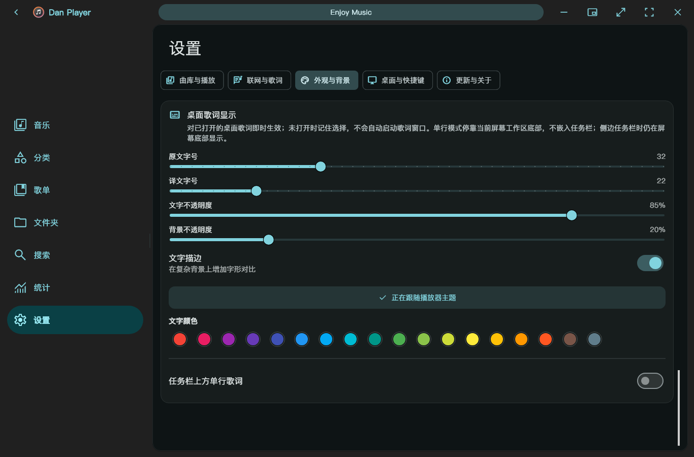
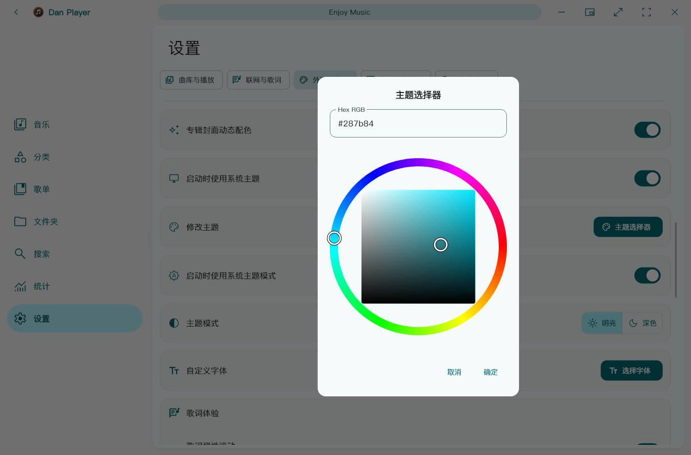
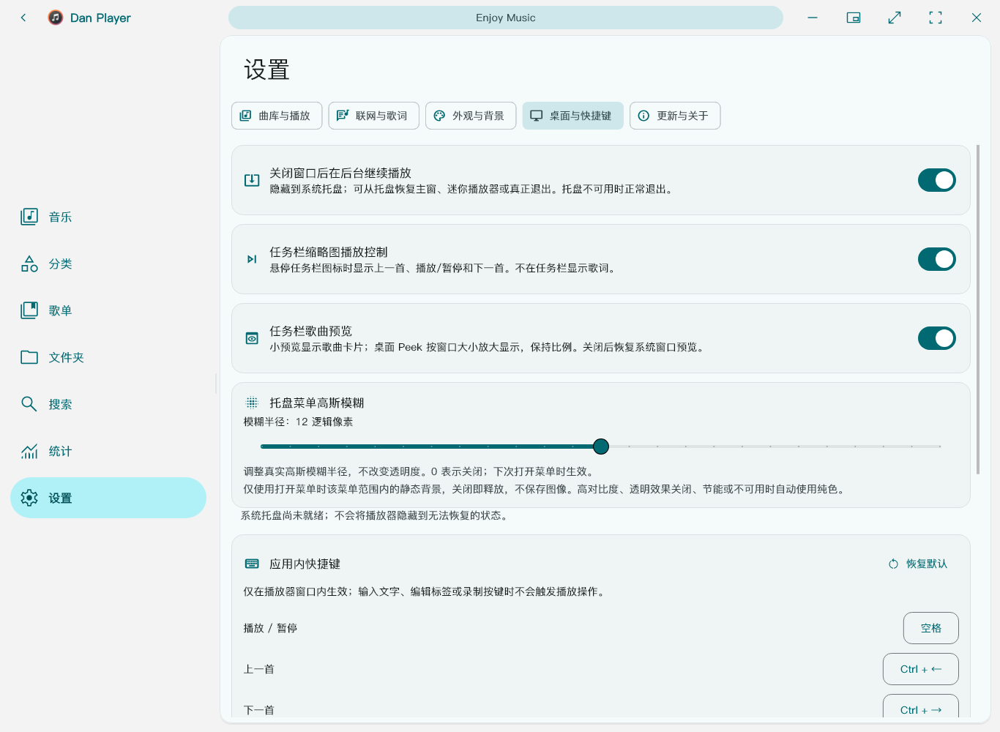

# Dan Player 功能导览

整理自己的曲库，换一种方式浏览歌单，再把歌词放到合适的位置。Dan Player 面向 Windows x64，提供本地音乐管理、可选联网检索、歌词与桌面播放体验。

[下载最新版本](https://github.com/DanRuguo/dan_player/releases/latest) · [全部 18 张界面示例](images/README.md) · [项目主页](../README.md)

本文所有画面都由实际生产 Flutter 组件离屏渲染。歌名、作曲家、演奏组、专辑、歌单、歌词和封面全部是专门创建的虚构示例；不是用户曲库或桌面截图，不包含第三方音乐封面。原生音频和联网服务未启动，具体渲染边界见 [示例说明](images/README.md)。

## 让曲库信息更清楚

音乐页可切换经典列表与分栏布局，查看歌名、作曲家、专辑和时长。搜索、随机播放、排序与列表／网格切换集中在顶部；窄窗自动采用适合的排列方式。

## 按创作者或音乐属性浏览

分类页可按艺术家、专辑、作曲家、语言、文件格式与来源浏览。圆形封面和分组搜索帮助定位曲目，而不用改变磁盘上的文件组织。

分类保留信息来源：作曲家缺失时可回退到参与创作的艺术家并单独标注；语言的标签、歌词线索、文字推断与未知相互区分。文字推断不是对音频演唱语言的识别，也不会写回音乐标签。参见 [分类说明](library-categories.md)。

## 一个歌单入口，多种整理方式

歌单支持列表、方形网格与圆形封面；可以选择歌曲、更换封面、改名和排序。子歌单与歌曲能够一起组织，旧合集会按迁移规则合并到统一入口。

移除歌单引用不会删除音频文件。旧数据迁移、重复引用、读取失败保护与备份边界见 [歌单说明](playlist-unification.md)。

## 让歌词跟着小窗口走

迷你播放器保留歌曲信息、封面、当前歌词与译文／下一句，并提供切歌、播放、进度和置顶入口。它使用同一播放会话，不需要启动第二个播放器。

上图是实际 `CompactPlayerView` 的静态暂停帧，文字为本图库新写的演示内容，不来自任何歌曲。它展示布局，不代表已在该画面中执行播放或 Windows 置顶操作。

## 把歌词调成自己喜欢的样子

桌面歌词可分别调整原文与译文字号、文字不透明度、背景不透明度和描边。默认跟随播放器主题，也可明确选择固定颜色；设置会由主程序保存。

桌面歌词另有横排、竖排和工作区底部单行模式。单行模式是独立歌词窗口，不嵌入 Windows 任务栏。主设置与歌词外观窗口复用同一套选项。参见 [歌词体验说明](lyric-experience-26.0.3.md)。

## 配色可以跟随封面，也可以自己选

专辑封面动态配色、明暗模式、字体与手动主题色都能在外观设置中选择。主题选择器支持色轮和 Hex RGB；按钮、图标和相关文字使用当前主题配色。

该图通过实际主题按钮打开对话框，渲染后取消，没有确认或保存用户设置。

## 为桌面使用准备的入口

可选关闭窗口后隐藏到托盘继续播放，并分别控制任务栏播放按钮和歌曲预览。启用歌曲预览时，小缩略图显示歌曲卡片，桌面 Peek 按窗口尺寸放大显示并保持比例；关闭后恢复系统窗口预览。

自有托盘菜单可设置 0–24 逻辑像素的真实高斯模糊半径，0 为关闭。它只在打开时使用菜单区域的静态背景，关闭释放资源；透明效果禁用、高对比、节能或资源限制时回退纯色，不是持续捕获桌面。离屏图没有启动系统托盘，因此保留“尚未就绪”提示，不伪造原生状态。详见 [桌面与播放体验](desktop-experience-26.0.3.md)。

## 搜索本地，也可选择联网歌源

搜索页区分总乐库、联网、艺术家与专辑结果。本地图中展示的是明确注入的虚构结果，联网部分为空，没有发送任何请求。

实际联网检索与播放受歌源授权、接口和网络可用性约束；当前内置来源不提供可靠下载能力，播放器不会绕过登录、付费或 DRM。歌源可以独立关闭，不删除已有收藏或歌单。参见 [歌源说明](online-sources.md)。

## 公开展示与来源

Dan Player 基于 [Ferry-200/coriander_player](https://github.com/Ferry-200/coriander_player) 修改；这是衍生分支，不代表上游项目背书。各依赖及参考项目保留其原有署名和许可证说明。

本图库由仓库内 [渲染测试](../test/public_ui_showcase_test.dart) 和 [生成脚本](../scripts/render_public_ui.ps1) 产生：使用生产控件、仓库字体及系统已有字体回退，不使用 AI 生图、不手绘冒充完整界面，也不采集用户桌面。测试可以检查布局与字形，但静态图不证明所有 Windows 设备上的音频、原生材质、性能或长期稳定性。
